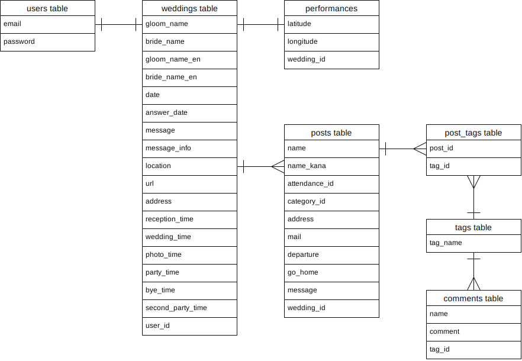

# アプリケーション名
Wedding Story

# アプリケーション概要

多機能の結婚式web招待状です。
ゲストは、出欠回答時にコミュニティーを選択することで、同じコミュニティーのゲストと、webアプリを通じて連絡を取り合うことができます。式後には、主催者が撮った写真をアプリ上でダウンロードすることができます。

# URL

現在制作中です。

# テスト用アカウント

現在制作中です。

# 利用方法

現在制作中です。

# アプリケーションを作成した背景

私自身が友人の結婚式に参列した際に感じた課題を解決するために、アプリを作成しました。
同じコミュニティーのゲストについては誰が招待されているか事前にわかることが多いですが、他のゲストは式当日まで知らないことが多いと思います。
私自身、友人の結婚式で、式当日に久しぶりに合う友人が参列していることを知り、話したいと思っても、タイミングが合わずなかなか話すことができないことが多々ありました。
そこで、事前に参列するゲストを把握できて、アプリ上で連絡を取ることができれば上記の課題が解決できると考え、開発することにしました。

# 工夫した点

現在制作中です。

# 要件定義

https://docs.google.com/spreadsheets/d/1El7ZD9fm_-Jr2JhrcqEYPfjM8ya9GUwQNrZF2jfcjP0/edit#gid=982722306

# 実施した機能についての画像やGIFおよびその説明

現在制作中です。

# 実施予定の機能
- ゲスト同士が式前後に連絡を取れるチャットルーム機能
- 式後に主催者が写真を投稿できるアルバム機能

# データベース設計

## users テーブル
| Column             | Type   | Options                   |
| ------------------ | ------ | ------------------------- |
| email              | string | null: false               |
| encrypted_password | string | null: false               |

### Association
- has_one :wedding

## weddings テーブル
| Column             | Type       | Options                        |
| ------------------ | ---------- | ------------------------------ |
| gloom_name         | string     | null: false                    |
| bride_name         | string     | null: false                    |
| gloom_name_en      | string     | null: false                    |
| bride_name_en      | string     | null: false                    |
| date               | date       | null: false                    |
| answer_date        | date       | null: false                    |
| message            | string     |                                |
| message_info       | string     |                                |
| location           | string     | null: false                    |
| url                | string     | null: false                    |
| address            | string     | null: false                    |
| reception_time     | time       | null: false                    |
| wedding_time       | time       | null: false                    |
| photo_time         | time       | null: false                    |
| party_time         | time       | null: false                    |
| bye_time           | time       | null: false                    |
| second_party_time  | time       | null: false                    |
| user               | references | null: false, foreign_key: true |

### Association
- belongs_to :user
- has_one    :performance
- has_many   :posts

## performances テーブル
| Column             | Type       | Options                        |
| ------------------ | ---------- | ------------------------------ |
| latitude           | float      | null: false                    |
| longitude          | float      | null: false                    |
| wedding            | references | null: false, foreign_key: true |

### Association
- belongs_to :wedding

## posts テーブル
| Column             | Type       | Options                        |
| ------------------ | ---------- | ------------------------------ |
| name               | string     | null: false                    |
| name_kana          | string     | null: false                    |
| attendance         | string     | null: false                    |
| category_gloom     | string     |                                |
| category_bride     | string     |                                |
| address            | string     | null: false                    |
| mail               | string     | null: false                    |
| departure          | date       |                                |
| go_home            | date       |                                |
| message            | string     | null: false                    |
| wedding            | references | null: false, foreign_key: true |

### Association
- belongs_to :wedding
- has_many   :post_tags
- has_many   :tags, through posts_tags

## tags テーブル
| Column             | Type       | Options                        |
| ------------------ | ---------- | ------------------------------ |
| tag_name           | string     | null: false                    |

### Association
- has_many   :post_tags
- has_many   :posts, through post_tags
- has_many   :comments

## post_tags テーブル
| Column       | Type       | Options                        |
| ------------ | ---------- | ------------------------------ |
| post         | references | null: false, foreign_key: true |
| tag          | references | null: false, foreign_key: true |

### Association
- belongs_to :post
- belongs_to :tag

## comments テーブル
| Column             | Type       | Options                        |
| ------------------ | ---------- | ------------------------------ |
| name               | string     | null: false                    |
| comment            | string     | null: false                    |
| tag                | references | null: false, foreign_key: true |

### Association
- belongs_to :tag

 
# 画面遷移図

現在制作中です。

# 開発環境

- フロントエンド

&emsp; HTML, CSS, JavaScript, jQuery

- バックエンド

&emsp; Ruby on Rails(Ruby)

- インフラ

&emsp; AWS(S3), Heroku

- OS

&emsp; Mac/Linux

- データベース

&emsp; MySQL

- タスク管理

&emsp; Github
